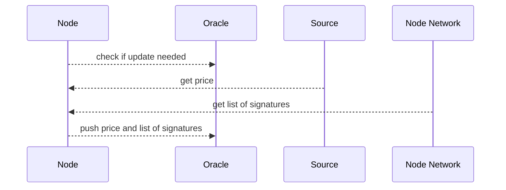

# [Arkadiko](https://arkadiko.finance/) Oracle

## Multisig oracle on Stacks
Oracles are often a key part of decentralised applications. Information from outside the blockchain needs to become accessible in a fast, accurate and decentralised fashion.

Many oracle systems put all data on-chain after which the data integrity can be evaluated. Meaning many transactions are needed, increasing fees and decreasing speed. Such a solution would not fit the slow block times seen on Stacks today. This is why we designed a secure multisig oracle solution where only one transaction is needed to update a price.

## Solution


Any node in the system periodically checks if the on-chain price needs to be updated. Currently this is based on the amount of blocks mined since last price update.

If the on-chain price needs an update, the node will fetch the price from its source and will ask all other nodes in the network to sign the given price. The other nodes will only sign the given price if it does not deviate too much from the price received from their own source.

If the node received enough signatures it means the price is considered valid by other nodes. The node will will push the price info and list of signatures to the oracle smart contract. The oracle contract will validate the signatures and save the price if enough valid signatures are provided.



## Signing

Each node has its own private key, and derived public key. A node can use the private key to sign a price message and create a signature. By taking the signature and message, the oracle smart contract can recover the public key used to sign the message. The recovered public key is checked against a list of trusted public keys to decide if the signature should be accepted. If the price message has been tampered with then the recovered public key will be wrong, and thus not trusted.

Recovering the public key is possible using the clarity function [secp256k1-recover?](https://docs.stacks.co/docs/write-smart-contracts/clarity-language/language-functions#secp256k1-recover).


## Setup

**Smart contract**
You can use the [Arkadiko oracle smart contract](https://explorer.stacks.co/txid/SP2C2YFP12AJZB4MABJBAJ55XECVS7E4PMMZ89YZR.arkadiko-oracle-v2-1?chain=mainnet) code to publish your own oracle smart contract. 

There are 3 admin functions to set up the oracle contract.

 - `set-trusted-oracle` must be used to add the public keys from trusted nodes
 - `set-token-id` can be used to add extra tokens to save prices for
 - `set-minimum-valid-signers` allows to set the amount of valid signatures required

**Nodes**
This repository provides the code (next.js) to run a node and can easily be deployed to hosting services such as Heroku or Vercel. You will need to set up some environment variables (see `env.example`) and update the file `config.ts` to fit your setup. The info used in `config.ts` is explained below.

```
  // The symbols to fetch prices for 
  symbols: ["STX", "BTC", "USDA", "DIKO", "auto-alex"],
  
  // Nodes in the network
  nodes: [
    "https://oracle-node-redstone.herokuapp.com",
    "https://oracle-node-coingecko.herokuapp.com",
    "https://oracle-node-cmc.herokuapp.com"
  ],
  
  // Private key, used to sign prices. Should be unique per node.
  signKey: process.env.SIGN_KEY as string,

  // Oracle smart contract address info 
  oracleAddress: "SP2C2YFP12AJZB4MABJBAJ55XECVS7E4PMMZ89YZR",
  oracleContractName: "arkadiko-oracle-v2-1",

  // The wallet used to push the prices on chain.
  managerAddress: "SP2YYZRZ210D7CPG5M8TDJE8V694B6AVGAKM99MH9",
  managerKey: process.env.STACKS_KEY as string,
  
  // Price is considered outdated if 6 blocks have passe
  inputMaxBlockDiff: 6,

  // Price is considered correct if it deviates less than 2.5% from source
  inputMaxPriceDiff: 0.025 
  
  // Network and source 
  networkName: network,
  network: new StacksMainnet(),
  stacksApiBase: "https://stacks-node-api.stacks.co",
  arkadikoAddress: "SP2C2YFP12AJZB4MABJBAJ55XECVS7E4PMMZ89YZR",
  alexAddress: "SP3K8BC0PPEVCV7NZ6QSRWPQ2JE9E5B6N3PA0KBR9",
  source: getSource(),
  sourceName: source,
  ```

The API endpoint `/generate` can be used to generate a private and public key.

**Cron jobs**
The API endpoint `/check` needs to be called periodically to check if prices need to be updated and perform the updates.

This repository contains a file `request.js` which can be used to set up a simple node scheduler to call given url. For example `node request.js https://oracle1.mysite.com/api/check`.

## Sources
Adding a new data source is easy. First, you need to create a class which implements the `PriceSourceInterface` interface. The interface has one function (`fetchPrice(symbol: string)`) to get the price for a given symbol. Secondly, add the new source to the factory method `getSource` in `config.ts`.

Prices for STX and BTC are fetched from different sources. There are 7 different sources included in the codebase. For DIKO, USDA, atALEX the prices are fetched from the AMMs.

## Symbols  
By default this oracle system saves prices for STX, BTC, DIKO, USDA and atALEX. If you want to add extra symbols you will need to:

 1. Add the symbol to the oracle smart contract
 2. Update all sources so prices for the new symbol can be fetched
 3. Add the symbol info to `tokenInfo` in `config.ts`

## Contact  
If you have any questions or suggestions, you can always reach out to the Arkadiko team and community on  [Discord](https://discord.gg/7UB6JjjCNV).

Contributions are always welcome and highly appreciated, just open a new PR and we will review.

